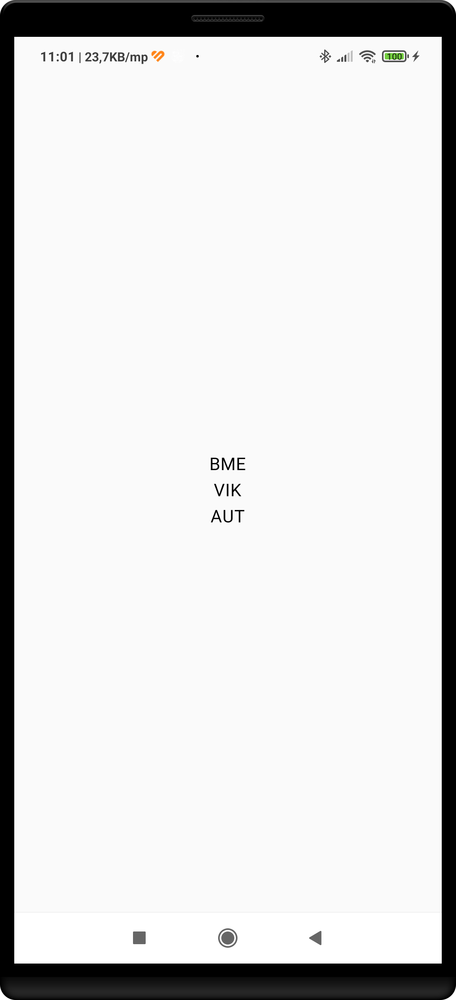
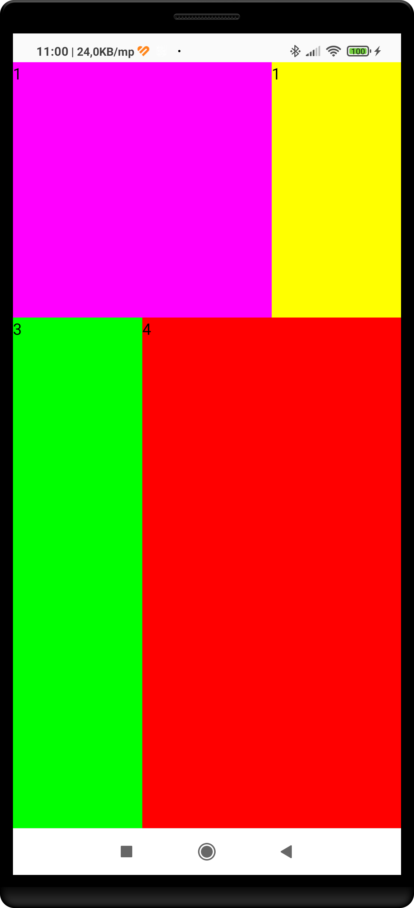
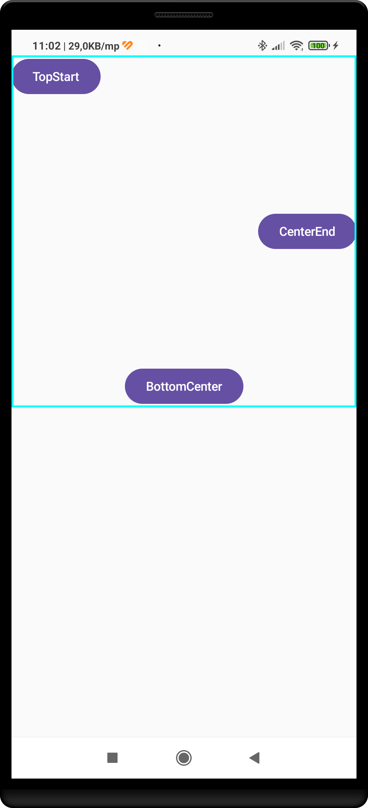
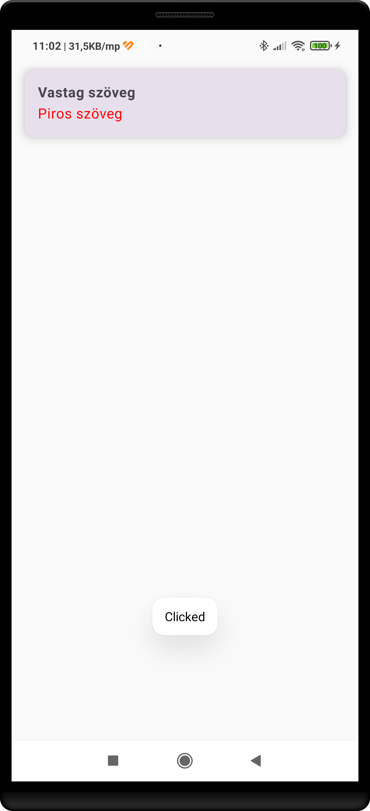

# Egyszerű oszlopos elrendezés

*Column* és *Text* Composable-k segítségével hozzuk létre az alábbi elrendezést!

Az elvárt eredmény:

# Egyszerű elrendezés súlyozással

*Row*, *Column* és *Text* Composable-k segítségével hozzuk létre az alábbi elrendezést!

Az elvárt eredmény:

# Egyszerű Box használat

*Box* és *Button* Composable-k segítségével hozzuk létre az alábbi elrendezést! A négyzet mérete legyen *400dp*, a keret színe ciánkék.

Az elvárt eredmény:

# Egyszerű Card használat

Hozzuk létre az alábbi kártya felületet! Elevation értéknek *8dp*, paddingnek *15dp* értéket válasszunk!

Az elvárt eredmény:

