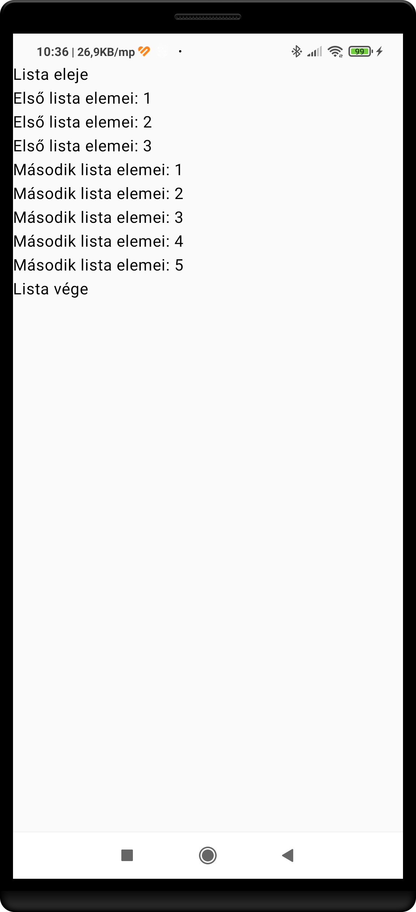
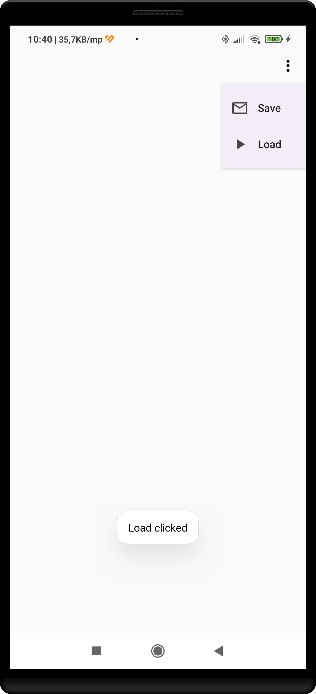
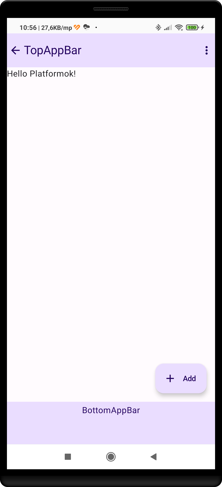
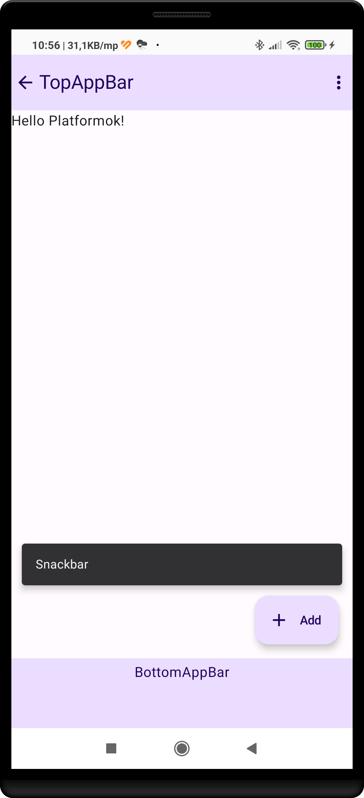

# LazyColumn
## *item* és *items* használata
Hozzunk létre egy listát, amelyben a következő szöveges elemek szerepelnek:
* "Lista eleje"
* "Első lista elemei : n" (Ahol n egy szám 1-től 3-ig)
* "Második lista elemei : n" (Ahol n egy szám 1-től 5-ig)
* "Lista Vége"  

Az elvárt eredmény:

## Egyszerű lista
Jelenítsünk meg egy listát a lenti városok nevével! 

*private val cityList = mutableListOf("Szeged", "Pécs", "Debrecen", "Budapest")*  
* Az elemek jelenjenek meg szürke háttéren fehér betűvel, 20-as betűméretben, a képernyő teljes szélességében!
* A sorok elejére tegyünk ikonokat!
* Két sor közé tegyünk elválasztó vonalat!  
* Állítsunk be paddinget az igényes megjelenítéshez!
* Egy sor megnyomása esetén jelenjen meg egy Toast üzenet a város nevével!
  
Az elvárt eredmény:

Az elvárt eredmény:

# DropDownMenu
Készítsünk DropDownMenu-t két opcióval!  
* Használjunk Box-ot befoglaló elemnek!  
* A *MoreVert* ikont felhasználva egy *IconButton* megnyomására nyíljon le a menü!
* A menülemek lenyomásakor jelenítsünk meg Toast üzenetet a menülemek feliratával megegyező szöveggel.

Az elvárt eredmény:

# Scaffold
Készítsünk egyszerű Material Design alkalmazás vázat, az alapértelmezett színek használatával!

Az elvárt eredmény:

# Snackbar
Az előző gyakorlatot egészítsük ki egy Snackbarral, amely egy ExtendedFloatingActionButton nyomására láthatóvá válik!

# További gyakorló feladatok
https://developer.android.com/codelabs/basic-android-kotlin-compose-composables-practice-problems
